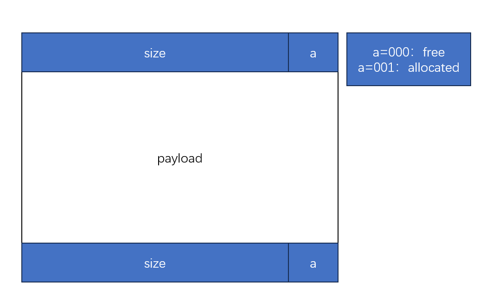

# 8-malloclab

**本实验应该算是最棘手的一个，各种指针交叠，但也是像bomblab一样很经典的实验**

### 1 简要分析

> 实验目的：熟悉C语言指针，熟悉动态内存的申请的方法和动态内存的结构
>
> 工作空间：mm.c
>
> 实验内容：写一个动态存储分配器，实现init，malloc，realloc，free等操作，并尽可能优化这个分配器，平衡吞吐率和空间利用率
>
> 实验工具：mdriver工具，可以检测正确性

### 2 具体实现

**1. 堆结构**

> 堆，是一个进程的虚拟内存区域。首先看一下堆结构


> 堆的地址是连续的，一整块内存区域都是堆，那么如何管理这一整块内存区域呢。有三种常见的方式
>
> 1. 隐式空闲列表（Implicit Free List）：
>    - 把整块堆切分为许多紧邻的块，每个块的头部包含了这个块的大小以及它是否被分配的信息，通过这个块的大小我们就能找到与它相连的下一块的起始地址
>    - 好处：简单
>    - 坏处：每次申请时需要从头开始遍历，吞吐量低下，且容易产生许多空间碎片
> 2. 显式空闲列表（Explicit Free Lists）：
>    - 对隐式空闲列表的改进，在隐式空闲列表基础上，每个空闲块除了存储它的大小和是否被分配的信息外，还存储了指向下一个和/或上一个空闲块的指针，这样查找空闲块的时候只需要遍历空闲列表
>    - 好处：提高了内存分配效率，降低空间碎片
>    - 坏处：需要多的空间存储指针，维护困难、
> 3. 分离空闲列表（Segregated Free Lists）：
>    - 维护多个空闲链表，每个链表中的块有大致相等的大小，分配器维护着一个空闲链表数组
>    - 好处：更加提高了内存分配效率，降低空间碎片
>    - 坏处：维护困难，可能导致空间利用率不高
>
> **我们的目的：平衡好吞吐率和空间利用率（这两个其实是冲突的，不可能吞吐率高又空间利用率高，因为高的吞吐率必然采用诸如链表，哈希表，树等结构，这些结构必然导致空间利用率降低，所以得平衡）**

**2. 块结构**

> 看看块结构，方便代码理解



**3. 实现**

**注意，代码阶段都是来自[CSAPP | Lab8-Malloc Lab 深入解析 - 知乎 (zhihu.com)](https://zhuanlan.zhihu.com/p/496366818)，大佬太厉害辣，我这里大概讲解一下**

> 1. 首先定义一堆方便操作的宏，我觉得这一堆宏简直是神来之笔，宏的作用大佬说的很清楚，我就不解释了

```
/* 头部/脚部大小 单字（四字节） */
#define WSIZE 4
/* 双字 */
#define DSIZE 8

/* 取最大值 */
#define MAX(a, b) ((a) > (b) ? (a) : (b))

/* 扩展堆时默认大小 */
#define CHUNKSIZE (1 << 12)

/* 设置头部/脚部值 */
#define PACK(size, alloc) ((size)|(alloc))

/* 读写指针p */
/*
	首先知道void*类型的指针可以指向任何地方，其实malloc函数申请的指针就是void*类型
	(unsigned int *)(p)的意思是将void*类型的指针p强转为指向unsigned int类型的指针
	然后(*(unsigned int *)(p))是取出该指针指向的unsigned int类型的值
*/
#define GET(p) (*(unsigned int *)(p))
#define PUT(p, val) ((*(unsigned int *)(p)) = (val))

/* 从头部或脚部获取大小或分配位 */
/* 这里0x是十六进制嗷，低一位表示是否已分配 */
#define GET_SIZE(p) (GET(p) & ~0x7)
#define GET_ALLOC(p) (GET(p) & 0x1)

/* 给定有效载荷指针，找到头部和脚部 */
#define HDRP(bp) ((char *)(bp) - WSIZE)
#define FTRP(bp) ((char *)(bp) + GET_SIZE(HDRP(bp)) - DSIZE)

/* 给定有效载荷指针, 找到前一块或下一块 */
#define NEXT_BLKP(bp) ((char*)(bp) + GET_SIZE(((char*)(bp) - WSIZE)))
#define PREV_BLKP(bp) ((char*)(bp) - GET_SIZE(((char*)(bp) - DSIZE)))
```

> 2. 然后定义需要用的函数，每个函数在这里都给出注释了

```
/**
 * @brief 初始化堆
 * 初始化一个堆，主要是定义了堆的序言块和结尾块，相当于开头和结尾，然后添加了一个CHUNKSIZE/WSIZE大小的空  间
 */
int mm_init(void);

/**
 * @brief 扩展堆
 * 用于扩展堆，每当需要申请动态内存的时候就调用该函数来申请动态内存空间
 *
 * @param words	申请的动态内存大小
 */
void *extend_heap(size_t words);

/**
 * @brief 释放内存
 *
 * @param ptr	需要释放的块指针
 */
void mm_free(void *ptr);

/**
 * @brief 分割空闲块
 * 判断剩下的空间是否足够存放头部和脚部，够的话就设置各种标志位，不够的话就要设置为填充的块
 *
 * @param bp	当前空闲块指针
 * @param asize	当前请求的块大小
 */
void place(void *bp, size_t asize);

/**
 * @brief 合并块
 * 合并块有四种情况，需要把相邻的空闲块合并在一起
 *
 * @param bp	需要合并的块指针
 */
void *coalesce(void *bp);

/**
 * @brief 首次适配原则
 *
 * @param asize	请求的块大小
 */
void *first_fit(size_t asize);

/**
 * @brief 自主实现的malloc
 *
 * @param size	申请的块大小
 */
void *mm_malloc(size_t size);

/**
 * @brief 重新申请块大小
 *
 * @param ptr	重新申请的块的指针
 * @param size	重新申请的块大小
 */
void *mm_realloc(void *ptr, size_t size);
```

> 接下来就是每一部分的代码，这一部分该大佬每个函数给出的注释很详细，我就不献丑辣，可以慢慢读。

**总结：终于更完辣。虽然最后一个实验更的很水，但总归是写完了。今后也要元气满满哦~**


